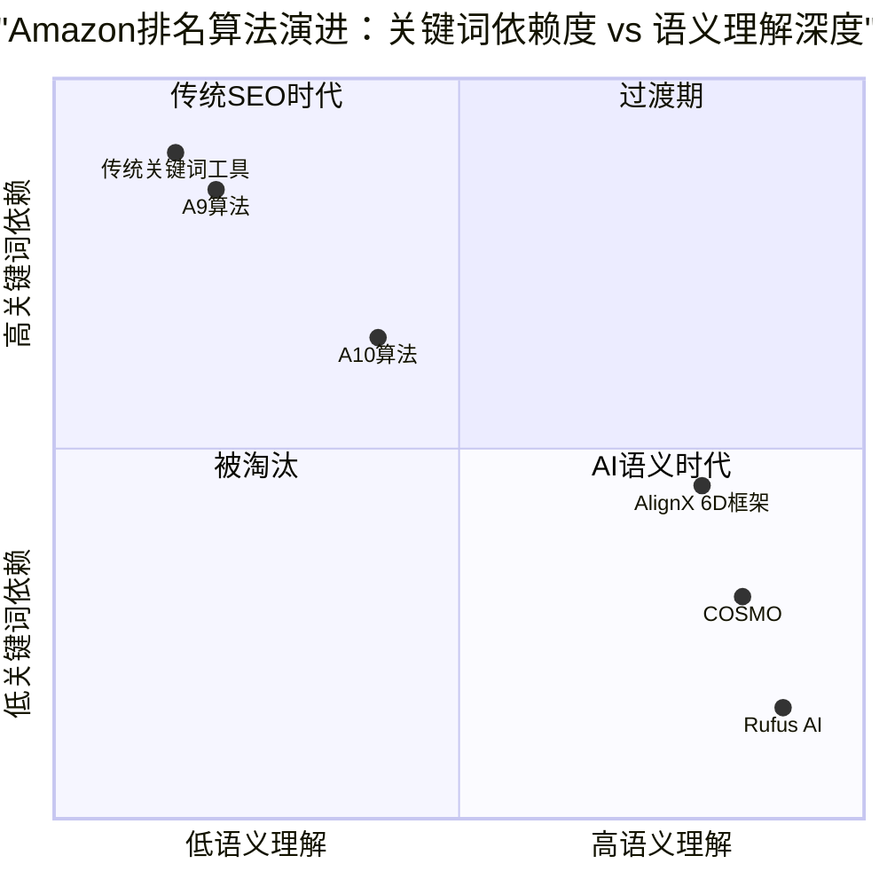

# Amazon产品排名核心要素与COSMO 6D语义框架关系研究报告

> **报告日期**：2026年3月19日  
> **项目背景**：AlignX — 面向中国跨境电商卖家的Amazon Listing智能优化运营中枢  
> **核心框架**：COSMO 6D语义翻译框架  

---

## 目录

1. [执行摘要](#1-执行摘要)
2. [Amazon排名算法演进分析](#2-amazon排名算法演进分析)
   - 2.1 A9算法核心逻辑
   - 2.2 A10算法升级要点
   - 2.3 COSMO算法的革命性变化
3. [Listing各要素排名权重深度分析](#3-listing各要素排名权重深度分析)
   - 3.1 产品标题（Title）
   - 3.2 五点描述（Bullet Points）
   - 3.3 产品图片（Images）
   - 3.4 A+内容（A+ Content）
   - 3.5 客户评论（Customer Reviews）
   - 3.6 后台搜索词与属性（Backend Keywords & Attributes）
4. [COSMO语义理解对排名逻辑的颠覆](#4-cosmo语义理解对排名逻辑的颠覆)
   - 4.1 从关键词匹配到语义意图匹配
   - 4.2 知识图谱驱动的商品发现
   - 4.3 个性化搜索与"千人千面"
5. [6D框架与Listing要素的映射关系](#5-6d框架与listing要素的映射关系)
   - 5.1 映射矩阵总览
   - 5.2 功能属性（Functional Attributes）
   - 5.3 使用场景（Usage Scenarios）
   - 5.4 用户画像（User Personas）
   - 5.5 购买动机（Purchase Motivations）
   - 5.6 竞品对比（Competitive Differentiation）
   - 5.7 趋势热点（Trend Alignment）
6. [AlignX产品功能优化建议](#6-alignx产品功能优化建议)
7. [结论与展望](#7-结论与展望)

---

## 1. 执行摘要

Amazon搜索算法正在经历从**关键词匹配时代**到**语义意图理解时代**的根本性转变。COSMO（Common Sense Knowledge Generation and Serving System）作为Amazon推出的AI驱动搜索框架，利用大语言模型构建了覆盖18个主要品类的知识图谱，将搜索理解从"用户说了什么"升级为"用户真正想要什么"。

在这一背景下，AlignX的COSMO 6D语义翻译框架——涵盖**功能属性、使用场景、用户画像、购买动机、竞品对比、趋势热点**六个维度——与Amazon新算法的底层逻辑高度契合。本报告通过深度分析排名要素权重、COSMO算法机制以及6D框架的映射关系，为AlignX产品功能的进一步优化提供数据驱动的战略建议。

**核心发现**：
- 传统Listing优化聚焦于关键词密度和匹配度，而COSMO时代要求**语义覆盖度**和**意图匹配度**
- 6D框架的六个维度精准覆盖了COSMO知识图谱的核心节点类型
- Listing各要素（标题、五点、图片、A+、评论）在6D框架下需要协同优化，而非孤立处理
- AlignX具备成为跨境电商卖家**AI时代运营中枢**的战略卡位优势

---

## 2. Amazon排名算法演进分析

### 2.1 A9算法核心逻辑

A9是Amazon最早公开的搜索排名算法，其核心设计理念是**以产品为中心的关键词匹配**。A9算法的排名决策主要基于以下因素：

**相关性因素**：A9通过分析Listing中的关键词与用户搜索词的匹配程度来判断相关性。标题中的关键词权重最高，其次是五点描述、产品描述和后台搜索词。算法采用线性相关性模型，即搜索词与产品属性之间的直接对应关系。

**绩效因素**：销售速度（Sales Velocity）是A9最核心的绩效指标。转化率（Conversion Rate）作为关键指标，成功Listing的转化率通常维持在19%以上。点击率（CTR）反映了搜索结果页面上产品的吸引力，直接影响排名。

**权威性因素**：卖家账户健康度、订单缺陷率（ODR）、配送表现等构成了卖家权威性评分。FBA（Fulfilled by Amazon）卖家在同等条件下享有排名优势。

A9的局限性在于其**线性匹配逻辑**——如果用户搜索"rain shoes"，只有包含这些精确关键词的Listing才能被匹配，而"waterproof boots"这样语义相关但词汇不同的产品可能被遗漏。

### 2.2 A10算法升级要点

A10算法在A9基础上进行了多项重要调整，标志着Amazon排名逻辑从**纯内部指标**向**综合生态指标**的转变：

| 维度 | A9算法 | A10算法 |
|------|--------|---------|
| 广告权重 | 高（PPC广告强烈影响排名） | 降低（有机表现更重要） |
| 外部流量 | 影响极小 | 成为重要排名信号 |
| 卖家权威性 | 中等权重 | 高权重（账户历史、反馈评分） |
| 有机vs付费 | 广告权重大 | 有机表现权重提升 |
| 社交信号 | 不考虑 | 纳入评估范围 |

A10的核心变化在于：**外部流量**（来自Google、社交媒体、KOL推荐等）成为重要排名信号。这意味着能够从Amazon站外引入高质量转化流量的卖家获得了显著的排名优势。同时，卖家权威性的权重提升，包括账户年龄、反馈评分、订单缺陷率和配送可靠性等综合指标。

### 2.3 COSMO算法的革命性变化

COSMO代表了Amazon搜索技术的**范式级跃迁**，从根本上改变了商品发现的底层逻辑：

**技术架构**：COSMO利用大语言模型（LLM）构建了一个包含数百万节点和边的知识图谱，覆盖Amazon 18个主要品类。系统通过COSMO-LM（Language Model）从仅30,000条标注指令中生成了数百万条高质量知识断言。

**核心能力**：
- **常识推理**：当用户搜索"shoes for pregnant women"时，COSMO能推断出孕妇需要防滑、舒适的鞋类——即使用户未明确搜索"防滑鞋"
- **跨品类关联**：购买瑜伽垫的用户可能被推荐泡沫滚轴、运动耳机等场景匹配产品
- **需求预判**：搜索"露营装备"时，不仅匹配帐篷、睡袋，还推测用户可能需要便携式户外电源、防蚊喷雾

**与A9/A10的关系**：COSMO并非取代A9/A10，而是在其基础上**叠加用户意图权重层**。卖家需要"既让A9看得懂（关键词匹配），又让COSMO看得上（场景化需求满足）"。



---

## 3. Listing各要素排名权重深度分析

### 3.1 产品标题（Title）

**权重等级：★★★★★（最高）**

产品标题是Amazon搜索算法中**权重最高的关键词承载位置**，也是影响点击率的第一触点。在移动端（占Amazon流量60%以上），标题的前80个字符决定了用户是否点击。

**排名影响机制**：
- **关键词索引**：标题中的关键词享有最高的索引权重，直接决定产品能否出现在特定搜索结果中
- **CTR驱动**：一个信息丰富且具吸引力的标题能显著提升点击率，而CTR是排名的核心绩效指标
- **COSMO语义解析**：在COSMO框架下，标题不仅需要包含关键词，更需要传达产品的核心使用场景和价值主张

**最佳实践演变**：
- **A9时代**：关键词堆叠，尽可能多地塞入搜索词（如"Bluetooth Speaker Wireless Portable Waterproof Outdoor Indoor"）
- **COSMO时代**：语义清晰的自然语言表达，突出核心场景和差异化价值（如"Portable Bluetooth Speaker for Beach & Camping — 24H Playtime, IP67 Waterproof"）

**6D框架关联**：标题应优先覆盖**功能属性**（核心参数）和**使用场景**（主要应用场景），同时隐含**用户画像**信息。

### 3.2 五点描述（Bullet Points）

**权重等级：★★★★☆（高）**

五点描述是Listing中**关键词覆盖面最广**的区域，也是转化率优化的核心战场。在移动端，前两条Bullet Points尤为关键，因为后续内容需要用户主动展开。

**排名影响机制**：
- **关键词广度**：五点描述提供了大量空间来覆盖长尾关键词、同义词和语义变体
- **转化率优化**：清晰、有说服力的五点描述直接影响购买决策，而转化率是排名的核心驱动力
- **COSMO语义信号**：五点描述中的场景化语言为COSMO提供了丰富的语义信号，帮助算法理解产品适用的用户群体和使用情境

**内容策略**：
- 第1点：核心卖点/差异化优势（对应6D的**竞品对比**维度）
- 第2点：主要使用场景（对应6D的**使用场景**维度）
- 第3点：关键功能参数（对应6D的**功能属性**维度）
- 第4点：目标用户/适用人群（对应6D的**用户画像**维度）
- 第5点：品质保证/售后承诺（对应6D的**购买动机**维度）

### 3.3 产品图片（Images）

**权重等级：★★★★☆（高，且权重持续上升）**

Amazon推荐使用7张高质量产品图片。主图（Main Image）对CTR的影响最为直接，而辅助图片通过提升用户停留时间和转化率间接影响排名。

**排名影响机制**：
- **CTR驱动**：主图质量直接决定搜索结果页面的点击率，尤其在移动端
- **转化率提升**：场景图、尺寸对比图、功能演示图能显著提升购买信心
- **COSMO多模态识别**：COSMO算法已开始"看懂图片"，场景图与用户意图的匹配度正在影响自然排名权重
- **停留时间**：高质量图片增加用户在产品页面的停留时间，这是算法评估用户参与度的重要信号

**6D框架关联**：
- **功能属性**：产品细节图、参数标注图
- **使用场景**：生活场景图、使用演示图
- **用户画像**：目标用户使用产品的场景图
- **购买动机**：对比图、效果展示图
- **竞品对比**：与竞品的视觉对比
- **趋势热点**：符合当下审美趋势的视觉风格

### 3.4 A+内容（A+ Content）

**权重等级：★★★☆☆（中高，且快速上升）**

A+内容（Enhanced Brand Content）在2025年的角色已从单纯的"转化率优化工具"演变为**间接排名因素**。

**排名影响机制**：
- **转化率提升**：Amazon官方数据显示，A+内容可将转化率提升3%-10%，部分卖家报告提升达20%-30%
- **销售额增长**：有效使用A+内容可将销售额提升最高20%
- **参与度信号**：A+内容增加页面停留时间、降低跳出率、提升交叉销售——这些参与度指标在A10算法中被纳入排名评估
- **内容索引**：Amazon算法现已开始**索引A+内容中的部分元素**，这意味着A+中的关键词布局可以直接影响搜索排名

**Premium A+（A++）**：提供互动热点、自动播放视频、轮播模块和全幅生活方式布局等高级功能，进一步提升停留时间和转化率。

**6D框架关联**：A+内容是6D框架**全维度展示**的最佳载体——通过图文结合的方式，可以系统性地覆盖功能属性、使用场景、用户画像、购买动机、竞品对比和趋势热点。

### 3.5 客户评论（Customer Reviews）

**权重等级：★★★★★（最高，与标题并列）**

客户评论是Amazon排名体系中**最具影响力的信任信号**，同时也是COSMO语义理解的重要数据来源。

**排名影响机制**：
- **直接排名信号**：评论的质量和数量是Amazon算法明确列出的绩效信号。4.5星以上评分的产品在其品类中占据约82%的销售额
- **转化率驱动**：高评分产品转化率更高，形成"高评分→高转化→高排名→更多曝光→更多销售"的正向飞轮
- **COSMO语义来源**：客户评论中的自然语言为COSMO提供了真实的用户需求描述。如果客户描述产品"great for beach weddings"，这一语义信号会被COSMO纳入知识图谱

**评论权重分层**：

| 评论类型 | 权重 | 说明 |
|---------|------|------|
| 近期已验证购买评论 | 最高 | 反映产品当前状态 |
| 历史已验证购买评论 | 中高 | 存在时间衰减 |
| 被标记为"有帮助"的评论 | 高 | 社区信任信号 |
| 未验证购买评论 | 低 | 受到更严格审查 |
| 负面评论 | 负权重 | 且衰减速度慢于正面评论 |

**6D框架关联**：客户评论是**验证6D语义覆盖度**的天然数据源。通过分析评论中的高频词汇和情感倾向，可以反向检验Listing在6个维度上的语义表现。

### 3.6 后台搜索词与属性（Backend Keywords & Attributes）

**权重等级：★★★☆☆（中，但在COSMO时代重要性急剧上升）**

后台搜索词和产品属性是**对用户不可见但对算法至关重要**的排名因素。在COSMO框架下，完整准确的属性填写成为产品被正确归类和推荐的基础。

**排名影响机制**：
- **关键词补充**：后台搜索词用于覆盖标题和五点中未能包含的关键词变体、同义词和长尾词
- **COSMO属性匹配**：产品属性（目标受众、材质、使用场合等）是COSMO知识图谱的核心数据节点。精准填写属性直接影响产品在语义搜索中的匹配度
- **品类归属**：正确的品类节点选择确保产品出现在相关的浏览路径中

---

## 4. COSMO语义理解对排名逻辑的颠覆

### 4.1 从关键词匹配到语义意图匹配

COSMO的引入标志着Amazon搜索从**"词对词"匹配**到**"意图对意图"匹配**的根本性转变。这一转变对Listing优化的影响是深远的：

**传统关键词匹配模式**：
```
用户搜索 "rain shoes" → 算法匹配包含 "rain" AND "shoes" 的Listing → 排名基于关键词密度+销量+转化率
```

**COSMO语义意图匹配模式**：
```
用户搜索 "rain shoes" → COSMO推理：
  ├── 功能需求：防水、防滑、快干
  ├── 使用场景：雨天通勤、户外活动
  ├── 用户画像：注重实用性的都市人群
  ├── 隐含需求：舒适、耐穿、易清洁
  └── 匹配产品：不仅限于标注"rain shoes"的产品，
      还包括"waterproof boots"、"all-weather sneakers"等语义相关产品
```

这意味着：
1. **关键词堆叠失效**：单纯增加关键词密度不再有效，甚至可能因为语义混乱而降低排名
2. **语义丰富度成为新竞争力**：能够在Listing中清晰表达产品的使用场景、适用人群和解决的问题的卖家将获得排名优势
3. **长尾语义词崛起**：精准的场景描述词（如"perfect for rainy commute"）比泛关键词（如"waterproof"）更有价值

### 4.2 知识图谱驱动的商品发现

COSMO的知识图谱是一个**三维网络结构**，将产品、属性、场景、用户需求连接成一个有机整体：

**知识图谱核心节点类型**：
- **产品节点**：具体的ASIN及其属性
- **功能节点**：产品的功能特性（防水、便携、耐用等）
- **场景节点**：使用场景（露营、通勤、健身等）
- **用户节点**：用户画像特征（孕妇、运动爱好者、办公室白领等）
- **需求节点**：购买动机（送礼、自用、替换旧产品等）
- **趋势节点**：当前热门趋势和季节性需求

**这与6D框架的六个维度形成了精确的一一对应关系**——这正是AlignX的6D框架具有战略价值的根本原因。

### 4.3 个性化搜索与"千人千面"

COSMO使Amazon搜索结果进入了**个性化时代**：

- **用户行为分析**：COSMO分析用户的搜索历史、浏览行为、购物记录和账户信息（如wish list、baby registry等）
- **动态排名调整**：不同用户搜索同一关键词，展示结果可能完全不同
- **跨品类推荐**：基于知识图谱的关联分析，实现跨品类的智能推荐

**对卖家的影响**：
- 需要理解目标用户的**完整购物旅程**，而非仅关注单一搜索词
- Listing内容需要覆盖**多种用户画像**的需求触点
- **FBT（Frequently Bought Together）**和关联流量的重要性大幅提升

---

## 5. 6D框架与Listing要素的映射关系

### 5.1 映射矩阵总览

下表展示了COSMO 6D框架的六个维度如何映射到Amazon Listing的各个要素：

| 6D维度 | 标题 | 五点描述 | 图片 | A+内容 | 后台属性 | 客户评论 |
|--------|------|---------|------|--------|---------|---------|
| **功能属性** | ★★★★★ | ★★★★☆ | ★★★★☆ | ★★★☆☆ | ★★★★★ | ★★★★☆ |
| **使用场景** | ★★★★☆ | ★★★★★ | ★★★★★ | ★★★★★ | ★★★★☆ | ★★★★★ |
| **用户画像** | ★★★☆☆ | ★★★★☆ | ★★★★★ | ★★★★★ | ★★★★★ | ★★★★★ |
| **购买动机** | ★★☆☆☆ | ★★★★★ | ★★★★☆ | ★★★★★ | ★★☆☆☆ | ★★★★★ |
| **竞品对比** | ★★★☆☆ | ★★★★☆ | ★★★☆☆ | ★★★★★ | ★☆☆☆☆ | ★★★★☆ |
| **趋势热点** | ★★★★☆ | ★★★☆☆ | ★★★★☆ | ★★★★☆ | ★★★☆☆ | ★★★☆☆ |

> ★的数量代表该Listing要素对该6D维度的承载能力和重要性

### 5.2 功能属性（Functional Attributes）

**定义**：产品的核心功能参数、技术规格、材质工艺等客观属性。

**COSMO关联**：功能属性是COSMO知识图谱中**产品节点的核心属性**，直接决定产品在功能性搜索查询中的匹配度。

**Listing映射**：

| Listing要素 | 功能属性的体现方式 | 示例 |
|------------|-------------------|------|
| 标题 | 核心参数前置 | "65W GaN USB-C Charger" |
| 五点描述 | 详细技术规格 | "Gallium Nitride technology delivers 65W in a palm-sized design" |
| 图片 | 参数标注图、细节特写 | 尺寸对比图、接口特写 |
| A+内容 | 技术对比表格 | GaN vs 传统充电器性能对比 |
| 后台属性 | 精确的技术参数填写 | Wattage: 65W, Technology: GaN |

**优化要点**：功能属性需要在标题和后台属性中**精确表达**，在五点描述中**详细阐述**，在图片和A+中**可视化呈现**。COSMO会将这些分散在不同位置的功能信息整合为统一的产品功能画像。

### 5.3 使用场景（Usage Scenarios）

**定义**：产品被使用的具体场景、环境、时间和方式。

**COSMO关联**：使用场景是COSMO语义理解的**核心推理维度**。当用户搜索"camping gear"时，COSMO会推理出露营场景下的一系列需求（防水、便携、耐用、户外照明等），并匹配覆盖这些场景语义的产品。

**Listing映射**：

| Listing要素 | 使用场景的体现方式 | 示例 |
|------------|-------------------|------|
| 标题 | 核心场景关键词 | "...for Travel, Office & Home" |
| 五点描述 | 场景化使用描述 | "Perfect companion for business trips — charges laptop and phone simultaneously" |
| 图片 | 生活场景图 | 咖啡馆办公、飞机上使用、家庭书桌场景 |
| A+内容 | 场景故事板 | 一天中不同场景的使用演示 |
| 后台属性 | 使用场合标签 | Occasion: Travel, Office, Home |

**优化要点**：使用场景是COSMO时代**最具差异化价值**的维度。同一产品通过覆盖不同使用场景，可以匹配更多元的搜索意图。AlignX应帮助卖家识别并覆盖目标市场中**高搜索量的场景词**。

### 5.4 用户画像（User Personas）

**定义**：产品的目标用户群体特征，包括人口统计、生活方式、偏好等。

**COSMO关联**：COSMO的个性化搜索核心就是**用户画像匹配**。算法会分析搜索用户的画像特征，并优先展示与该画像匹配度高的产品。例如，一位经常购买科技产品的用户搜索"charger"时，COSMO会优先展示具有技术先进性的充电器。

**Listing映射**：

| Listing要素 | 用户画像的体现方式 | 示例 |
|------------|-------------------|------|
| 标题 | 目标人群暗示 | "...for MacBook Pro Users" |
| 五点描述 | 人群痛点描述 | "Designed for digital nomads who need reliable power on the go" |
| 图片 | 目标用户形象 | 商务人士、科技爱好者使用产品的场景 |
| A+内容 | 用户故事 | 不同用户群体的使用案例 |
| 后台属性 | 目标受众标签 | Target Audience: Tech Professionals |
| 客户评论 | 真实用户反馈 | "As a frequent traveler, this charger is a game-changer" |

**优化要点**：用户画像维度在后台属性和A+内容中的承载能力最强。AlignX应帮助卖家基于美区消费者画像数据，精准定位目标用户群体，并在Listing中植入相应的画像触点。

### 5.5 购买动机（Purchase Motivations）

**定义**：驱动用户购买的深层心理动机，包括解决痛点、情感满足、社交认同等。

**COSMO关联**：购买动机是COSMO理解用户**"为什么买"**的关键维度。当用户搜索"gift for tech lover"时，COSMO识别出购买动机是"送礼"，并优先匹配具有礼品属性（精美包装、品牌知名度、独特性）的产品。

**Listing映射**：

| Listing要素 | 购买动机的体现方式 | 示例 |
|------------|-------------------|------|
| 五点描述 | 痛点-解决方案叙事 | "Tired of carrying multiple chargers? One device powers all your gadgets" |
| 图片 | 效果对比图、before/after | 传统充电器vs GaN充电器的体积对比 |
| A+内容 | 价值主张故事 | 品牌故事、用户证言、信任背书 |
| 客户评论 | 真实购买原因 | "Bought this to replace 3 separate chargers" |

**优化要点**：购买动机是转化率优化的**核心杠杆**。AlignX应帮助卖家识别美区消费者的核心购买动机（如便利性、性价比、环保意识、品牌信任等），并在五点描述和A+内容中精准触达。

### 5.6 竞品对比（Competitive Differentiation）

**定义**：产品相对于竞品的差异化优势和独特卖点。

**COSMO关联**：COSMO的知识图谱天然包含**产品间的关联和对比关系**。当用户浏览某一产品时，COSMO会基于知识图谱推荐替代品和互补品。清晰的差异化定位有助于产品在COSMO的推荐网络中占据有利位置。

**Listing映射**：

| Listing要素 | 竞品对比的体现方式 | 示例 |
|------------|-------------------|------|
| 标题 | 差异化关键词 | "World's Smallest 65W GaN Charger" |
| 五点描述 | 竞争优势陈述 | "40% smaller than traditional 65W chargers" |
| A+内容 | 产品对比表格 | 与同类产品的功能/价格/尺寸对比 |
| 客户评论 | 用户自发对比 | "Much better than my old Anker charger" |

**优化要点**：竞品对比维度在A+内容中的承载能力最强（对比表格模块）。AlignX应提供**自动化竞品分析**功能，帮助卖家识别差异化机会并在Listing中有效传达。

### 5.7 趋势热点（Trend Alignment）

**定义**：产品与当前市场趋势、季节性需求、社会热点的契合度。

**COSMO关联**：COSMO的知识图谱是**动态更新**的，会纳入当前的消费趋势和季节性需求变化。与趋势热点高度契合的产品在特定时间段内会获得额外的排名提升。

**Listing映射**：

| Listing要素 | 趋势热点的体现方式 | 示例 |
|------------|-------------------|------|
| 标题 | 趋势关键词 | "2026 Upgraded Version" / "Eco-Friendly" |
| 五点描述 | 趋势相关特性 | "Made with recycled materials — join the sustainable tech movement" |
| 图片 | 符合当下审美趋势的视觉风格 | 极简设计、环保主题 |
| A+内容 | 趋势叙事 | 可持续发展承诺、技术创新故事 |

**优化要点**：趋势热点是一个**时间敏感**的维度。AlignX应提供**实时趋势监测**功能，帮助卖家及时调整Listing内容以匹配当前市场热点。

---

## 6. AlignX产品功能优化建议

基于以上分析，以下是对AlignX产品功能的战略性优化建议：

### 6.1 核心功能升级（P0 — 必须实现）

#### 6.1.1 6D语义覆盖度评分系统

**现状**：当前Listing体检已升级为6D框架，但评分维度需要与Amazon排名权重深度对齐。

**建议**：
- 为每个6D维度建立**加权评分模型**，权重基于该维度对排名的实际影响力
- 引入**语义覆盖度热力图**，可视化展示Listing在6个维度上的语义分布
- 提供**缺失语义建议**：不仅告诉卖家缺少哪些关键词，更要告诉他们缺少哪些**语义概念**

**权重建议**：
| 维度 | 建议权重 | 理由 |
|------|---------|------|
| 功能属性 | 20% | 基础匹配要素，必须准确 |
| 使用场景 | 25% | COSMO最核心的推理维度 |
| 用户画像 | 20% | 个性化搜索的关键匹配因素 |
| 购买动机 | 15% | 转化率的核心驱动力 |
| 竞品对比 | 10% | 差异化定位 |
| 趋势热点 | 10% | 时间敏感的加分项 |

#### 6.1.2 Listing要素级6D分析

**建议**：在现有的整体6D分析基础上，增加**按Listing要素分解的6D分析**：
- 标题6D覆盖度分析
- 五点描述6D覆盖度分析
- 图片6D覆盖度分析（基于图片描述文本）
- A+内容6D覆盖度分析
- 后台属性6D覆盖度分析

这样卖家可以精确知道**哪个要素在哪个维度上存在语义缺口**。

#### 6.1.3 评论语义反向验证

**建议**：新增**评论6D语义分析**功能：
- 抓取产品评论，分析评论中自然出现的6D语义分布
- 将评论语义与Listing语义进行**对比分析**
- 识别"评论中高频出现但Listing中未覆盖"的语义概念——这些是**最有价值的优化机会**

### 6.2 差异化功能（P1 — 应该实现）

#### 6.2.1 COSMO知识图谱可视化

**建议**：为每个产品品类构建**简化版COSMO知识图谱可视化**：
- 展示产品在知识图谱中的位置
- 显示与产品关联的场景节点、用户节点、需求节点
- 标识**未覆盖的关联节点**作为优化方向

#### 6.2.2 竞品6D对比雷达图

**建议**：升级ASIN诊断的竞品对比功能：
- 支持最多5个竞品ASIN的6D雷达图叠加对比
- 自动识别**竞品语义盲区**（竞品未覆盖但有搜索需求的维度）
- 生成**差异化策略建议**

#### 6.2.3 美区消费者意图数据库

**建议**：构建并持续更新**美区消费者搜索意图数据库**：
- 按品类收集高频搜索查询
- 对每个查询进行6D维度标注
- 提供**意图匹配度评分**：卖家输入ASIN，系统自动计算该产品与品类高频搜索意图的匹配度

### 6.3 前瞻性功能（P2 — 可以实现）

#### 6.3.1 AI Agent自动优化建议

**建议**：基于6D分析结果，AI自动生成**优化后的Listing文案**：
- 自动重写标题，优化6D语义覆盖
- 自动生成五点描述，确保每一点覆盖不同的6D维度
- 自动生成A+内容大纲，基于6D框架规划内容结构

#### 6.3.2 Rufus AI模拟器

**建议**：构建**Rufus AI对话模拟器**：
- 模拟用户通过Rufus AI搜索产品的对话场景
- 测试Listing在不同对话查询下的匹配表现
- 帮助卖家理解AI代理时代的产品发现逻辑

#### 6.3.3 趋势预测引擎

**建议**：基于历史数据和AI预测，提供**品类趋势预测**：
- 预测未来30/60/90天的热门搜索趋势
- 推荐应提前布局的趋势关键词
- 与6D框架的"趋势热点"维度深度集成

---

## 7. 结论与展望

### 7.1 核心结论

1. **Amazon排名逻辑已发生根本性转变**：从A9的关键词匹配，到A10的综合生态评估，再到COSMO的语义意图理解，排名的核心驱动力已从"关键词密度"转向"语义覆盖度"和"意图匹配度"。

2. **6D框架与COSMO知识图谱高度契合**：AlignX的6D框架（功能属性、使用场景、用户画像、购买动机、竞品对比、趋势热点）精准映射了COSMO知识图谱的核心节点类型，这不是巧合，而是对Amazon搜索演进方向的正确预判。

3. **Listing各要素需要协同优化**：在6D框架下，标题、五点描述、图片、A+内容、评论和后台属性不再是孤立的优化对象，而是需要在6个维度上**协同覆盖、互相补充**的有机整体。

4. **评论是6D语义验证的金矿**：客户评论中的自然语言是验证Listing语义覆盖度的最佳数据源，也是发现优化机会的关键入口。

### 7.2 战略展望

Amazon正在从**搜索平台**向**AI驱动的发现平台**转型。随着Rufus AI等对话式购物助手的普及，未来用户可能只需对AI说一句话，AI就会从各个平台找到最适合的产品推荐给用户。

在这一趋势下，AlignX的战略定位——**帮助中国跨境电商卖家在AI语义时代优化产品发现**——具有巨大的发展潜力。6D框架不仅是当前COSMO算法的最佳应对策略，更是面向未来AI Agent购物时代的**前瞻性布局**。

**AlignX的终极愿景**：成为跨境电商卖家的**AI时代运营中枢**，从语义翻译、Listing优化、ASIN诊断到趋势预测，构建完整的数据驱动运营闭环。

---

> **报告声明**：本报告基于公开信息和行业研究数据编写，分析结论仅供AlignX产品团队内部决策参考。Amazon算法细节为商业机密，本报告中的权重分析基于行业共识和实证研究推断。