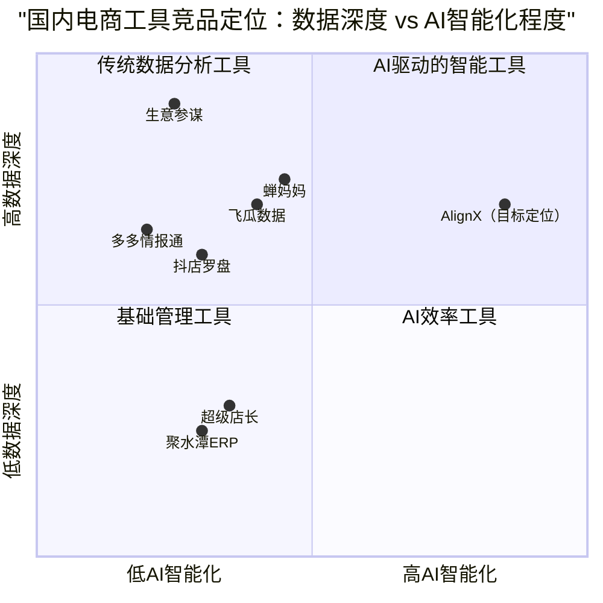

# AlignX 国内电商平台适配调研报告

> **报告日期**：2026年3月19日  
> **项目背景**：AlignX — 基于 COSMO 6D 语义分析框架的 AI 驱动电商 Listing 优化平台  
> **调研目标**：评估 AlignX 核心技术架构向国内电商平台迁移的可行性、市场机会与实施路径  

---

## 目录

1. [执行摘要](#1-执行摘要)
2. [国内主流电商平台概览](#2-国内主流电商平台概览)
   - 2.1 淘宝/天猫
   - 2.2 京东
   - 2.3 拼多多
   - 2.4 抖音电商
   - 2.5 小红书/快手电商
   - 2.6 平台格局对比
3. [国内电商搜索排名算法分析](#3-国内电商搜索排名算法分析)
   - 3.1 各平台搜索算法核心逻辑
   - 3.2 与 Amazon COSMO 的异同对比
   - 3.3 AI 语义化趋势的共性
4. [竞品分析](#4-竞品分析)
   - 4.1 生意参谋（淘系官方）
   - 4.2 蝉妈妈（抖音生态）
   - 4.3 超级店长（多平台 SaaS）
   - 4.4 多多情报通（拼多多生态）
   - 4.5 其他竞品概览
   - 4.6 竞品对比矩阵
   - 4.7 竞品定位象限图
5. [AlignX 技术适配分析](#5-alignx-技术适配分析)
   - 5.1 COSMO 6D 框架的国内适配方案
   - 5.2 AI Agent 驱动优化的迁移路径
   - 5.3 技术架构复用评估
6. [平台 API 能力对比](#6-平台-api-能力对比)
   - 6.1 淘宝/天猫开放平台
   - 6.2 京东开放平台
   - 6.3 拼多多开放平台
   - 6.4 抖音电商开放平台
   - 6.5 API 能力综合对比
7. [市场机会与优先级建议](#7-市场机会与优先级建议)
   - 7.1 市场规模与增长潜力
   - 7.2 差异化竞争优势
   - 7.3 平台优先级排序
   - 7.4 商业模式建议
8. [风险与挑战](#8-风险与挑战)
   - 8.1 技术风险
   - 8.2 市场风险
   - 8.3 合规风险
   - 8.4 运营风险
9. [实施路线图](#9-实施路线图)
10. [结论](#10-结论)

---

## 1. 执行摘要

### 1.1 核心结论

AlignX 的 COSMO 6D 语义分析框架和 AI Agent 驱动优化技术，具备向国内电商平台迁移的**高度可行性和巨大市场潜力**。核心判断如下：

1. **技术可迁移性强**：国内电商平台（尤其是淘宝、抖音）正在经历与 Amazon 类似的"从关键词匹配到 AI 语义理解"的算法升级，AlignX 的 6D 语义框架可以适配国内平台的搜索推荐逻辑。

2. **市场空白明确**：国内现有电商工具（生意参谋、蝉妈妈、超级店长等）主要聚焦于**数据分析和运营效率**，尚无产品从**AI 语义优化**的角度切入 Listing 内容质量提升。这是 AlignX 的核心差异化机会。

3. **市场规模可观**：2024年中国电商 SaaS 市场规模达 1437.6 亿元，年复合增长率 34.65%。AI 驱动的智能优化工具是增长最快的细分赛道。

4. **建议优先切入抖音电商**：抖音电商 GMV 增速超 30%（2025年预计突破 4.3 万亿），且其"内容+货架"双驱动模式对语义优化的需求最为迫切，竞争格局尚未固化。

### 1.2 关键数据

| 指标 | 数据 |
|------|------|
| 国内电商 SaaS 市场规模（2024） | 1,437.6 亿元 |
| 年复合增长率（2015-2024） | 34.65% |
| 抖音电商 GMV 增速（2025E） | >30% |
| 75% ERP 商家已部署 AI 功能 | 行业渗透率 |
| AI 工具使 ACOS 平均下降 | 28% |
| 国内电商卖家总量 | 超 2,000 万 |

---

## 2. 国内主流电商平台概览

### 2.1 淘宝/天猫

**平台定位**：中国最大的综合电商平台，覆盖全品类、全价格带。

**2025年核心数据**：
- 预计 GMV：约 8.3 万亿元，增速约 6%
- MAU：9.83 亿
- 88VIP 会员：5,300 万，贡献 70% 以上成交额

**搜索算法演进**：淘宝在 2025 年完成了搜推广体系的 AI 全面升级，利用大模型重构商品库，为 20 亿商品系统梳理标签，部分商品信息丰富度增加超 30%。推出六大 AI 导购工具（AI 万能搜、AI 帮我挑、AI 清单、拍立淘、AI 试穿、AI Summary），购物逻辑从"人理解商城"转向"商城理解人"。

**对 AlignX 的意义**：淘宝的 AI 搜索升级与 Amazon COSMO 的方向高度一致——都是从关键词匹配走向语义意图理解。淘宝为 20 亿商品梳理标签的动作，本质上就是在构建类似 COSMO 的商品知识图谱。AlignX 的 6D 语义框架可以帮助卖家主动优化商品标签丰富度，抢占 AI 搜索红利。

### 2.2 京东

**平台定位**：以自营为核心的品质电商平台，强项在 3C 数码、家电、日用百货。

**2025年核心数据**：
- 预计 GMV：约 4.5 万亿元，增速约 7%
- MAU：5.51 亿
- 年度活跃用户突破 7 亿，季度活跃用户同比增长超 40%

**搜索算法特点**：京东以 JoyAI 大模型为核心，已在超 1,800 个场景应用，超 3 万个智能体化身"数字员工"。搜索排名侧重供应链效率指标（库存周转天数仅 30 天）、物流时效、商品品质评分。自营商品在搜索中享有天然权重优势。

**对 AlignX 的意义**：京东的搜索排名更偏向供应链和品质指标，语义优化的空间相对有限。但第三方卖家（尤其是日用百货、服饰等增速品类）仍有 Listing 优化需求。京东可作为第二阶段拓展目标。

### 2.3 拼多多

**平台定位**：社交电商平台，以"质价比"为核心竞争力。

**2025年核心数据**：
- 预计 GMV：约 5.5 万亿元，增速约 15%
- MAU：7.08 亿
- 流量集中在 APP 和微信小程序

**搜索算法特点**：2025 年拼多多从"绝对低价"策略转向"质价比"平衡，搜索排名核心要素包括百亿补贴权重、拼团转化率、社交裂变数据、商家服务质量评分。品质指标权重持续提升。

**对 AlignX 的意义**：拼多多的搜索逻辑更偏向价格和社交裂变，对语义优化的需求相对较弱。但随着平台向品质化转型，商品描述质量的重要性正在上升。可作为长期观察目标。

### 2.4 抖音电商

**平台定位**：兴趣电商 + 货架电商双驱动，内容与交易深度融合。

**2025年核心数据**：
- 预计 GMV：约 4.3 万亿元，增速 >30%（增速最快）
- DAU：约 8 亿
- MAU：9.36 亿
- 人均日使用时长：93 分钟
- 货架场景 GMV 占比：约 40%（618 期间接近 50%）

**搜索算法特点**：抖音电商采用独特的"三池流量分配机制"——M1（自然流量，基于内容质量）、M2（交易流量，基于成交转化）、M3（广告流量，基于广告投放）。搜索排名关键因素包括短视频/直播内容质量、店播活跃度、商品卡转化率、用户停留时长、退货率。

**对 AlignX 的意义**：抖音电商是 AlignX 国内化的**最佳切入点**。原因如下：
- **内容驱动**：抖音的"内容+货架"模式对商品描述的语义质量要求极高，商品卡的标题、描述直接影响搜索排名和推荐匹配
- **增速最快**：30%+ 的 GMV 增速意味着大量新卖家涌入，对优化工具的需求旺盛
- **竞争格局未固化**：相比淘系（生意参谋垄断）和拼多多（多多情报通成熟），抖音电商的 SaaS 工具生态仍在快速演变
- **AI 语义契合度高**：抖音的推荐算法本质上就是基于内容语义理解的，与 AlignX 的 6D 框架天然契合

### 2.5 小红书/快手电商

**小红书**：2025 年电商 GMV 快速增长，以"种草+购买"闭环为特色，强调内容质量和社区信任。搜索排名高度依赖内容质量、笔记互动数据和商品标签匹配度。对语义优化的需求较高，但平台规模相对较小，可作为差异化切入的补充渠道。

**快手电商**：以下沉市场为核心，直播电商占比高。搜索排名侧重主播信任度和性价比，对 Listing 语义优化的需求相对有限。

### 2.6 平台格局对比

| 维度 | 淘宝/天猫 | 京东 | 拼多多 | 抖音电商 | 小红书 |
|------|----------|------|--------|---------|--------|
| **2025E GMV** | ~8.3万亿 | ~4.5万亿 | ~5.5万亿 | ~4.3万亿 | ~5000亿 |
| **GMV增速** | ~6% | ~7% | ~15% | >30% | >40% |
| **MAU** | 9.83亿 | 5.51亿 | 7.08亿 | 9.36亿 | 3.2亿 |
| **搜索模式** | AI语义搜索 | 品质+供应链 | 价格+社交 | 内容+货架 | 种草+搜索 |
| **AI化程度** | ★★★★★ | ★★★★☆ | ★★★☆☆ | ★★★★★ | ★★★★☆ |
| **语义优化需求** | ★★★★★ | ★★★☆☆ | ★★☆☆☆ | ★★★★★ | ★★★★☆ |
| **AlignX适配度** | ★★★★★ | ★★★☆☆ | ★★☆☆☆ | ★★★★★ | ★★★★☆ |

---

## 3. 国内电商搜索排名算法分析

### 3.1 各平台搜索算法核心逻辑

#### 淘宝/天猫：AI 语义搜索时代

淘宝的搜索算法在 2025 年经历了根本性升级。核心变化包括：

**商品标签体系重构**：利用大模型为 20 亿商品系统梳理标签，商品信息丰富度增加超 30%。这意味着算法不再仅依赖卖家手动填写的属性，而是通过 AI 自动理解商品的多维度语义信息。

**六大 AI 导购工具**：
- **AI 万能搜**：支持模糊搜索和自然语言查询，如"适合小个子女生的通勤包"
- **AI 帮我挑**：对话式筛选，理解用户的复合需求
- **AI 清单**：基于用户历史偏好的个性化推荐列表
- **拍立淘**：多模态搜索，以图搜图
- **AI 试穿**：虚拟试穿体验
- **AI Summary**：商品摘要与口碑整合，自动提炼评论要点

**排名权重因素**：
1. 商品标签丰富度与准确度（权重大幅提升）
2. 用户行为数据（点击率、转化率、收藏加购率）
3. 88VIP 会员消费权重
4. 全站推广 ROI
5. 店铺综合评分（DSR）

#### 京东：品质+供应链驱动

京东的搜索排名逻辑与其自营基因密切相关：

**JoyAI 大模型**：已在超 1,800 个场景应用，超 3 万个智能体服务商家和用户。但 AI 主要用于供应链优化和客服效率提升，在搜索语义理解方面的应用相对保守。

**排名权重因素**：
1. 商品品质评分（自营商品天然优势）
2. 物流时效（211 限时达等）
3. 库存周转效率
4. 用户评价质量
5. 品牌权重（知名品牌享有排名加成）

#### 拼多多：价格+社交裂变

拼多多的搜索排名逻辑围绕"质价比"展开：

**排名权重因素**：
1. 百亿补贴标签（享有流量倾斜）
2. 商品价格竞争力
3. 拼团转化率和社交裂变数据
4. 商家服务质量评分
5. 退款率和纠纷率（负向指标）

#### 抖音电商：内容质量+交易效率

抖音电商的搜索排名是最复杂的，因为它融合了内容推荐和电商搜索两套逻辑：

**三池流量模型**：
- **M1（自然流量池）**：基于内容质量分配，考量短视频完播率、互动率、内容标签匹配度
- **M2（交易流量池）**：基于成交转化分配，考量商品卡点击率、转化率、客单价
- **M3（广告流量池）**：基于广告投放效率分配，考量 ROI、千次曝光成本

**货架搜索排名因素**：
1. 商品标题与搜索词的语义匹配度
2. 商品卡点击率和转化率
3. 店铺评分和退货率
4. 短视频/直播内容关联度
5. 品牌权重和达人背书

### 3.2 与 Amazon COSMO 的异同对比

| 对比维度 | Amazon COSMO | 淘宝 AI 搜索 | 抖音电商搜索 |
|---------|-------------|-------------|-------------|
| **核心技术** | LLM 驱动的知识图谱 | 大模型标签重构 | 内容理解+推荐算法 |
| **语义理解深度** | 深（630万节点知识图谱） | 中高（20亿商品标签） | 高（多模态内容理解） |
| **个性化程度** | 高（千人千面） | 高（88VIP差异化） | 极高（兴趣推荐） |
| **内容形态** | 文本+图片 | 文本+图片+短视频 | 短视频+直播+商品卡 |
| **关键词依赖度** | 降低中 | 降低中 | 较低（内容驱动） |
| **卖家可优化空间** | 大（Listing全要素） | 大（标题+属性+详情） | 大（内容+商品卡） |

**核心发现**：国内平台（尤其是淘宝和抖音）正在经历与 Amazon 类似的"语义化升级"，但路径有所不同：
- Amazon 是从**搜索引擎**角度构建知识图谱
- 淘宝是从**商品标签**角度重构语义体系
- 抖音是从**内容理解**角度实现语义匹配

这三条路径最终都指向同一个目标：**理解用户的真实意图，匹配最相关的商品**。AlignX 的 6D 语义框架恰好覆盖了这一共性需求。

### 3.3 AI 语义化趋势的共性

通过对比分析，我们识别出国内外电商平台在 AI 语义化方面的五大共性趋势：

**趋势一：从关键词匹配到意图理解**
所有平台都在弱化关键词精确匹配的权重，转向理解用户搜索背后的真实意图。淘宝的"AI 万能搜"支持"适合小个子女生的通勤包"这样的自然语言查询，与 Amazon COSMO 的常识推理能力异曲同工。

**趋势二：从单一维度到多维度语义**
平台不再仅从"功能"维度理解商品，而是从场景、人群、趋势等多维度构建商品语义画像。这与 AlignX 的 6D 框架（功能、场景、身份、趋势、心理、风险平衡）高度一致。

**趋势三：从静态标签到动态知识图谱**
商品标签从卖家手动填写的静态属性，演变为 AI 自动生成和动态更新的知识图谱节点。这意味着卖家需要提供更丰富的语义信息，让 AI 能够准确理解和归类商品。

**趋势四：从文本到多模态**
搜索理解从纯文本扩展到图片、短视频、直播等多模态内容。抖音电商的搜索排名已经将短视频内容质量纳入考量，淘宝的"拍立淘"支持以图搜图。

**趋势五：从全局排名到个性化推荐**
所有平台都在推进"千人千面"的个性化搜索结果，不同用户搜索同一关键词看到的商品排序可能完全不同。这要求商品的语义覆盖面足够广，才能匹配更多用户画像。

---

## 4. 竞品分析

### 4.1 生意参谋（淘系官方）

**产品定位**：阿里巴巴官方商家数据平台，淘宝/天猫卖家的标配工具。

**核心能力**：
- **流量分析**：流量来源构成、跳失率、停留时长、访客行为轨迹
- **转化分析**：转化漏斗、加购率、收藏率、下单人数
- **商品分析**：引流能力、收藏加购、支付转化、商品温度计
- **市场行情**：行业大盘、搜索词分析、人群画像
- **竞争分析**：竞争情报、竞店监控
- **实时直播**：秒级延迟监控、实时催付
- **数据作战室**：多店汇总、行业排名、物流追踪

**收费模式**：基础功能免费，高级功能（市场行情、竞争情报等）付费订购。

**优势**：
- 官方数据源，数据准确性和实时性最高
- 与淘宝生态深度集成，无缝对接
- 功能覆盖面广，从流量到转化到竞争全链路

**劣势**：
- **仅限淘系平台**，无法跨平台使用
- **侧重数据展示，缺乏优化建议**：告诉卖家"是什么"，但不告诉"怎么做"
- **无 AI 语义分析能力**：不提供 Listing 内容质量评估和优化建议
- **无自动化优化功能**：所有优化动作需要卖家手动执行

**与 AlignX 的差异**：生意参谋是"数据仪表盘"，AlignX 是"AI 优化引擎"。两者互补而非竞争——卖家可以用生意参谋看数据，用 AlignX 优化内容。

### 4.2 蝉妈妈（抖音生态）

**产品定位**：抖音电商数据分析平台，服务商家、达人和内容创作者。

**核心能力**：
- **数据分析与监控**：达人带货 GMV、商品销量趋势、直播间实时场观与成交
- **达人筛选与匹配**：聚合超 1 亿抖音创作者资源，AI 智能推荐合作对象
- **短视频内容洞察**：拆解"开头钩子—核心卖点—信任背书—行动指令"四段式结构
- **智能选品**：覆盖 60 万+ 高佣爆品，AI 蓝海发现功能
- **竞品全链路追踪**：实时抓取竞品直播间数据，自动生成竞品策略分析报告

**优势**：
- 抖音生态数据最全面，覆盖达人、商品、直播、短视频全维度
- AI 能力较强，有蓝海发现、智能推荐等功能
- 内容洞察能力突出，能拆解高转化内容结构

**劣势**：
- **仅限抖音平台**
- **侧重数据分析和选品，缺乏 Listing 内容优化**：能告诉卖家"什么好卖"，但不能帮助优化"怎么卖"
- **无语义分析框架**：不从语义维度评估商品描述质量
- **内容洞察停留在模板层面**：提供高转化文案模板，但不提供基于商品特性的个性化语义优化

**与 AlignX 的差异**：蝉妈妈擅长"发现机会"（选品、找达人），AlignX 擅长"优化表达"（语义优化、内容质量提升）。在抖音生态中，两者可以形成互补。

### 4.3 超级店长（多平台 SaaS）

**产品定位**：一站式多平台电商管理工具，覆盖 10+ 电商平台。

**核心能力**：
- **多平台管理**：淘宝、拼多多、抖音、1688、小红书、快手、京东等
- **商品管理**：极速上货、全网铺货、1688 代发铺货
- **订单管理**：打单发货、进销存管理
- **营销工具**：直播助手、店铺动效、超级详情
- **财务分析**：成本利润核算

**关键数据**：
- 累计服务 450 万+ 客户，120 万+ 有效付费客户
- 日订单处理量突破 3,000 万单
- 母公司光云科技 2024 年营收 4.78 亿元，毛利率 65.51%

**优势**：
- **多平台覆盖**：一个工具管理所有店铺
- **功能全面**：从上货到发货到财务的全链路
- **用户基数大**：450 万+ 客户的规模效应
- **AI 客服能力**：快麦小智接入多个大模型，客服效率提升 300%

**劣势**：
- **功能广而不深**：每个功能都有，但都不够专业深入
- **无语义分析能力**：商品优化停留在基础层面（标题关键词、价格调整）
- **无 AI 内容优化**：不提供基于语义理解的 Listing 质量评估
- **工具属性强，智能属性弱**：更像"效率工具"而非"智能助手"

**与 AlignX 的差异**：超级店长是"运营效率工具"，AlignX 是"AI 语义优化引擎"。超级店长解决"做得快"的问题，AlignX 解决"做得好"的问题。

### 4.4 多多情报通（拼多多生态）

**产品定位**：拼多多大数据分析平台，服务超 300 万拼多多商家。

**核心能力**：
- **数据大盘**：全站 GMV 和销量走势、TOP10 品牌
- **行业分析**：类目数据变化趋势、价格区间与销量分布
- **榜单分析**：店铺/商品排行、爆款分析
- **数据监控**：竞品销量走势、热门 SKU 监控
- **选款选词**：关键词卡位、引流关键词挖掘

**优势**：
- 深耕拼多多数据多年，是拼多多官方第三方合作伙伴
- 功能覆盖从选款到爆款打造全阶段
- 电商生态圈完整（数据+培训+代运营+招商）

**劣势**：
- **仅限拼多多平台**
- **数据分析为主，缺乏内容优化能力**
- **无 AI 语义分析**
- **拼多多平台对语义优化的需求本身较弱**（价格驱动为主）

### 4.5 其他竞品概览

| 工具名称 | 平台 | 核心功能 | 与 AlignX 的关系 |
|---------|------|---------|-----------------|
| **聚水潭** | 多平台 | ERP/订单管理/库存同步 | 运营效率工具，无语义优化 |
| **旺店通** | 多平台 | ERP/仓储管理/财务 | 供应链工具，无语义优化 |
| **飞瓜数据** | 抖音/快手 | 直播数据/达人分析 | 数据分析工具，与蝉妈妈类似 |
| **电霸** | 拼多多 | 数据分析/选品 | 与多多情报通类似 |
| **千牛** | 淘系 | 店铺管理/客服/营销 | 官方管理工具，无语义优化 |
| **抖店罗盘** | 抖音 | 官方数据分析 | 类似生意参谋，数据展示为主 |

### 4.6 竞品对比矩阵

| 能力维度 | 生意参谋 | 蝉妈妈 | 超级店长 | 多多情报通 | **AlignX（目标）** |
|---------|---------|--------|---------|-----------|-------------------|
| **数据分析** | ★★★★★ | ★★★★☆ | ★★★☆☆ | ★★★★☆ | ★★★☆☆ |
| **语义分析** | ☆☆☆☆☆ | ★☆☆☆☆ | ☆☆☆☆☆ | ☆☆☆☆☆ | ★★★★★ |
| **内容优化** | ☆☆☆☆☆ | ★★☆☆☆ | ★☆☆☆☆ | ☆☆☆☆☆ | ★★★★★ |
| **AI 智能化** | ★★☆☆☆ | ★★★☆☆ | ★★☆☆☆ | ★☆☆☆☆ | ★★★★★ |
| **多平台支持** | ★☆☆☆☆ | ★☆☆☆☆ | ★★★★★ | ★☆☆☆☆ | ★★★★☆ |
| **选品能力** | ★★★★☆ | ★★★★★ | ★★★☆☆ | ★★★★☆ | ★★☆☆☆ |
| **竞品分析** | ★★★★☆ | ★★★★☆ | ★★☆☆☆ | ★★★★☆ | ★★★★☆ |
| **自动化程度** | ★☆☆☆☆ | ★★☆☆☆ | ★★★☆☆ | ★☆☆☆☆ | ★★★★★ |

**关键发现**：在"语义分析"和"AI 内容优化"两个维度上，现有竞品几乎为空白。这正是 AlignX 的核心差异化优势。

### 4.7 竞品定位象限图

**解读**：现有竞品集中在象限左侧（低 AI 智能化），AlignX 的目标定位在右上象限（高 AI 智能化 + 高数据深度），形成明显的差异化。

---

## 5. AlignX 技术适配分析

### 5.1 COSMO 6D 框架的国内适配方案

AlignX 现有的 COSMO 6D 框架（功能/Function、场景/Scenario、身份/Identity、趋势/Trend、心理/Psychology、风险平衡/Risk Balance）是为 Amazon 美区市场设计的。适配国内电商平台需要进行以下调整：

#### 5.1.1 维度重新定义

| 原 6D 维度 | 国内适配维度 | 调整说明 |
|-----------|------------|---------|
| **Function（功能）** | **功能属性** | 基本不变，增加国内消费者关注的参数（如国标认证、适配国内电压等） |
| **Scenario（场景）** | **使用场景** | 从美国场景替换为中国场景（如春节送礼、618大促、开学季、通勤地铁等） |
| **Identity（身份）** | **用户画像** | 从美国人群替换为中国消费者画像（如Z世代、宝妈、银发族、小镇青年、新中产等） |
| **Trend（趋势）** | **趋势热点** | 从美国趋势替换为中国消费趋势（如国潮、新中式、多巴胺穿搭、松弛感等） |
| **Psychology（心理）** | **购买动机** | 调整为中国消费者心理（如面子消费、从众心理、性价比焦虑、品质升级等） |
| **Risk Balance（风险平衡）** | **信任背书** | 从美国信任信号替换为中国信任信号（如天猫旗舰店、7天无理由、运费险、直播实拍等） |

#### 5.1.2 平台差异化适配

不同平台对 6D 各维度的权重需要差异化配置：

| 维度 | 淘宝/天猫 | 抖音电商 | 京东 | 拼多多 |
|------|----------|---------|------|--------|
| **功能属性** | 20% | 15% | 25% | 15% |
| **使用场景** | 25% | 30% | 15% | 10% |
| **用户画像** | 20% | 20% | 15% | 10% |
| **趋势热点** | 10% | 20% | 5% | 5% |
| **购买动机** | 15% | 10% | 15% | 25% |
| **信任背书** | 10% | 5% | 25% | 35% |

**权重设计逻辑**：
- **淘宝**：AI 语义搜索升级后，场景和画像维度权重最高
- **抖音**：内容驱动模式下，场景和趋势维度权重最高（内容需要"有趣"和"应景"）
- **京东**：品质导向平台，功能属性和信任背书权重最高
- **拼多多**：价格敏感平台，购买动机（性价比）和信任背书（品质保障）权重最高

#### 5.1.3 中国本土化语义库

需要构建中国本土化的语义知识库，覆盖以下内容：

**场景语义库**：
- 节日场景：春节、中秋、七夕、双11、618、年货节、开学季
- 生活场景：通勤地铁、居家办公、露营野餐、健身房、宿舍生活
- 社交场景：朋友聚会、公司团建、相亲约会、家庭聚餐

**人群语义库**：
- 代际标签：Z世代（00后）、千禧一代（90后）、X世代（80后）、银发族
- 生活阶段：大学生、职场新人、新手妈妈、二胎家庭、退休人士
- 消费标签：精致妈妈、小镇青年、新中产、品质控、性价比党

**趋势语义库**：
- 审美趋势：国潮、新中式、多巴胺穿搭、美拉德色系、松弛感
- 消费趋势：悦己消费、情绪价值、健康焦虑、可持续消费
- 平台趋势：抖音同款、小红书爆款、直播间专享、限时秒杀

### 5.2 AI Agent 驱动优化的迁移路径

AlignX 现有的 AI Agent 架构可以按以下路径迁移到国内平台：

#### 5.2.1 核心 Agent 适配

| Agent 功能 | Amazon 版本 | 国内版本 | 适配难度 |
|-----------|-----------|---------|---------|
| **语义翻译** | 中文→英文（美区语义） | 中文→平台语义（各平台标签体系） | ★★★☆☆ |
| **6D 分析** | COSMO 15 关系映射 | 平台标签体系映射 | ★★★★☆ |
| **Listing 体检** | Amazon Listing 评分 | 多平台商品详情评分 | ★★★☆☆ |
| **关键词优化** | Amazon 搜索词优化 | 多平台搜索词+标签优化 | ★★★☆☆ |
| **竞品分析** | ASIN 对比分析 | 商品 ID 对比分析 | ★★☆☆☆ |

#### 5.2.2 新增 Agent 需求

国内版本需要新增以下 Agent：

1. **内容创作 Agent**：针对抖音电商，自动生成商品卡标题、短视频脚本大纲、直播话术要点
2. **多平台同步 Agent**：一份商品信息自动适配多个平台的标题规范和属性要求
3. **趋势追踪 Agent**：实时监控各平台热搜词、热门标签、爆款趋势
4. **评论语义分析 Agent**：分析商品评论中的高频语义，反向优化商品描述

### 5.3 技术架构复用评估

| 技术组件 | 复用程度 | 说明 |
|---------|---------|------|
| **前端 UI 框架** | 90% | Shadcn/UI + TypeScript + Tailwind CSS 完全复用 |
| **6D 分析引擎** | 70% | 核心逻辑复用，Prompt 和语义库需重写 |
| **AI 模型调用层** | 85% | 模型接口层复用，Prompt 模板需适配 |
| **数据存储层** | 80% | Atoms Cloud 后端复用，数据模型需扩展 |
| **API 对接层** | 20% | 需要全新开发各平台 API 对接 |
| **用户认证系统** | 95% | 基本完全复用 |

**总体评估**：约 60-70% 的代码和架构可以复用，主要新增工作量在平台 API 对接和本土化语义库构建。

---

## 6. 平台 API 能力对比

### 6.1 淘宝/天猫开放平台

**API 成熟度**：★★★★★（最成熟）

**核心接口**：

| 接口类别 | 主要接口 | AlignX 可用性 |
|---------|---------|-------------|
| **商品信息获取** | `taobao.item.seller.get`、`taobao.items.onsale.get` | ✅ 可获取标题、描述、属性等 |
| **商品发布与更新** | `taobao.item.add`、`taobao.item.update` | ✅ 可实现优化后自动更新 |
| **库存管理** | `taobao.item.quantity.update` | ⚠️ 非核心需求 |
| **数据分析** | 订单推送服务、交易数据 | ✅ 可用于效果追踪 |

**技术要点**：
- OAuth 2.0 认证，授权有效期一年
- 涉及敏感数据的 API 必须从聚石塔 ECS 发起调用
- 所有 API 有 QPS 限制
- 签名机制：HMAC-MD5，全部 HTTPS

**对 AlignX 的限制**：
- 需要通过淘宝服务市场审核才能上架
- 部分高级数据接口需要特殊权限
- 聚石塔部署要求增加了技术复杂度

### 6.2 京东开放平台

**API 成熟度**：★★★★☆

**核心接口**：

| 接口类别 | 主要接口 | AlignX 可用性 |
|---------|---------|-------------|
| **商品详情查询** | `jingdong.ware.product.detail.get` | ✅ 可获取商品信息 |
| **价格查询** | `jingdong.price.get` | ⚠️ 需特殊权限 |
| **智能推荐** | `item_recommend` | ✅ 可用于竞品分析 |
| **历史价格** | `item_history_price` | ✅ 可用于市场分析 |

**技术要点**：
- OAuth 2.0 认证，Access Token 有效期约 30 天
- 企业认证可达 50 次/秒调用频率
- 2024 年商品 ID 升级为动态字符串格式
- 价格变动响应延迟 ≤3 秒

**对 AlignX 的限制**：
- 京东以自营为主，第三方卖家 API 权限有限
- 商品更新接口对第三方工具的开放程度不如淘宝

### 6.3 拼多多开放平台

**API 成熟度**：★★★☆☆

**核心接口**：

| 接口类别 | 主要接口 | AlignX 可用性 |
|---------|---------|-------------|
| **商品详情** | `item_get` | ✅ 可获取标题、价格、图片等 |
| **商品搜索** | `item_search` | ✅ 可用于竞品分析 |
| **商品评论** | `item_review` | ✅ 可用于评论语义分析 |
| **以图搜索** | `item_search_img` | ⚠️ 非核心需求 |

**技术要点**：
- 支持多种编程语言
- 接口响应速度快，支持高并发
- 多多进宝 API 需绑定 client_id 且不可解绑

**对 AlignX 的限制**：
- 拼多多平台对第三方工具的开放程度相对保守
- 商品更新接口的开放程度有限

### 6.4 抖音电商开放平台

**API 成熟度**：★★★☆☆（快速完善中）

**核心接口**：

| 接口类别 | 主要接口 | AlignX 可用性 |
|---------|---------|-------------|
| **订单数据** | 订单基础、支付信息、渠道来源 | ✅ 可用于效果追踪 |
| **商品管理** | 商品发布、更新（通过抖店） | ✅ 可实现优化后更新 |
| **数据分析** | 销售趋势、流量数据 | ✅ 可用于效果评估 |

**技术要点**：
- OAuth 授权跳转到抖店平台完成
- 支持一键创建数据集
- 收件人信息加密传输，符合《个人信息保护法》

**对 AlignX 的限制**：
- API 文档和生态相比淘宝仍在完善中
- 部分高级数据接口尚未开放
- 需要通过抖店服务市场审核

### 6.5 API 能力综合对比

| 能力维度 | 淘宝/天猫 | 京东 | 拼多多 | 抖音电商 |
|---------|----------|------|--------|---------|
| **API 文档完善度** | ★★★★★ | ★★★★☆ | ★★★☆☆ | ★★★☆☆ |
| **商品信息获取** | ★★★★★ | ★★★★☆ | ★★★★☆ | ★★★☆☆ |
| **商品信息更新** | ★★★★★ | ★★★☆☆ | ★★★☆☆ | ★★★☆☆ |
| **数据分析接口** | ★★★★★ | ★★★★☆ | ★★★☆☆ | ★★★☆☆ |
| **第三方工具友好度** | ★★★★★ | ★★★☆☆ | ★★★☆☆ | ★★★★☆ |
| **审核难度** | ★★★☆☆ | ★★★★☆ | ★★★☆☆ | ★★★☆☆ |
| **实时性** | ★★★★☆ | ★★★★★ | ★★★★☆ | ★★★☆☆ |

**结论**：淘宝 API 最成熟，但审核和部署要求较高；抖音 API 快速完善中，对第三方工具友好度较高，是最佳切入点。

---

## 7. 市场机会与优先级建议

### 7.1 市场规模与增长潜力

#### 7.1.1 整体市场

2024 年中国电商 SaaS 市场规模达 **1,437.6 亿元**，2015-2024 年年复合增长率 **34.65%**。其中：

- **AI 驱动的智能优化工具**是增长最快的细分赛道
- **75% 的 ERP 商家已部署 AI 优化功能**，AI 渗透率快速提升
- AI 工具使广告 ACOS 平均下降 28%，订单处理效率提升 50%

#### 7.1.2 目标市场规模估算

AlignX 国内版的目标市场可按以下方式估算：

| 平台 | 活跃卖家数（估） | 潜在付费用户（5%渗透率） | ARPU（年） | 市场规模 |
|------|----------------|----------------------|-----------|---------|
| 淘宝/天猫 | 1,000 万 | 50 万 | 2,000 元 | 10 亿元 |
| 抖音电商 | 500 万 | 25 万 | 2,400 元 | 6 亿元 |
| 京东 | 100 万 | 5 万 | 2,000 元 | 1 亿元 |
| 拼多多 | 800 万 | 20 万 | 1,200 元 | 2.4 亿元 |
| **合计** | **2,400 万** | **100 万** | — | **~19.4 亿元** |

> 注：以上为保守估算，实际市场规模可能更大。随着 AI 搜索普及，卖家对语义优化工具的需求将快速增长。

### 7.2 差异化竞争优势

AlignX 在国内市场的核心差异化优势：

**优势一：唯一的 AI 语义优化引擎**
现有竞品（生意参谋、蝉妈妈、超级店长等）都是"数据分析工具"或"运营效率工具"，没有一款产品从 AI 语义维度切入商品内容优化。AlignX 可以填补这一空白。

**优势二：跨平台语义框架**
6D 语义框架可以适配多个平台，帮助卖家用一套方法论优化所有平台的商品内容。这是单平台工具（生意参谋、蝉妈妈）无法提供的价值。

**优势三：从"分析"到"优化"的闭环**
现有工具告诉卖家"数据是什么"，AlignX 告诉卖家"内容应该怎么写"并自动生成优化建议。这是从"信息工具"到"决策工具"的质变。

**优势四：AI 时代的先发优势**
国内平台的 AI 搜索升级刚刚开始（淘宝 2025 年才完成大模型标签重构），卖家对"如何适应 AI 搜索"的认知和工具需求正在快速形成。AlignX 可以抢占这一认知窗口。

### 7.3 平台优先级排序

基于市场机会、技术适配度、竞争格局和 API 能力的综合评估，建议按以下优先级切入：

#### 第一优先级：抖音电商 ⭐⭐⭐⭐⭐

**理由**：
- GMV 增速最快（>30%），大量新卖家涌入，工具需求旺盛
- "内容+货架"双驱动模式对语义优化需求最强
- 竞争格局未固化，蝉妈妈侧重数据分析，语义优化赛道空白
- 商品卡标题和描述直接影响搜索排名，优化空间大
- 抖音的推荐算法本质上基于内容语义理解，与 6D 框架天然契合

**切入策略**：
- 首先推出"抖音商品卡 6D 语义体检"功能
- 自动生成优化后的商品标题和描述
- 提供短视频脚本的语义优化建议

#### 第二优先级：淘宝/天猫 ⭐⭐⭐⭐☆

**理由**：
- 最大的电商平台，卖家基数最大
- AI 搜索升级后对语义优化的需求急剧上升
- API 最成熟，技术对接最便利
- 但生意参谋的官方地位和用户粘性构成竞争壁垒

**切入策略**：
- 定位为生意参谋的"AI 语义优化补充工具"
- 重点推出"标题 6D 语义评分"和"五点描述优化"功能
- 通过淘宝服务市场上架获取流量

#### 第三优先级：小红书 ⭐⭐⭐☆☆

**理由**：
- 内容驱动的电商平台，对语义质量要求高
- 增速快（>40%），生态工具尚不成熟
- 但平台规模相对较小，商业化程度有限

#### 第四优先级：京东 ⭐⭐☆☆☆

**理由**：
- 品质和供应链驱动，语义优化需求相对有限
- 自营为主，第三方卖家工具市场较小

#### 第五优先级：拼多多 ⭐⭐☆☆☆

**理由**：
- 价格驱动为主，语义优化需求最弱
- 但随着品质化转型，未来需求可能上升

### 7.4 商业模式建议

#### 7.4.1 定价策略

| 版本 | 月费 | 功能 | 目标用户 |
|------|------|------|---------|
| **免费版** | 0 元 | 每月 3 次 6D 语义体检 | 新手卖家试用 |
| **基础版** | 99 元/月 | 单平台、50 次/月分析、基础优化建议 | 个人卖家 |
| **专业版** | 299 元/月 | 多平台、无限分析、AI 自动优化、竞品对比 | 中型卖家 |
| **企业版** | 999 元/月 | 全平台、团队协作、API 接入、定制报告 | 品牌商/代运营 |

#### 7.4.2 增长策略

1. **内容营销**：在抖音、小红书发布"AI 语义优化"相关教育内容，建立行业认知
2. **KOL 合作**：与电商培训 KOL 合作推广，利用其粉丝基础快速获客
3. **免费工具引流**：推出免费的"商品标题评分"小工具，作为获客入口
4. **平台服务市场**：在淘宝、抖音的服务市场上架，获取平台流量
5. **代运营合作**：与电商代运营公司合作，将 AlignX 嵌入其服务流程

---

## 8. 风险与挑战

### 8.1 技术风险

**风险 8.1.1：平台算法黑箱**
国内电商平台的搜索排名算法不公开，且频繁调整。AlignX 的 6D 语义优化效果难以量化验证。

**应对策略**：
- 建立 A/B 测试机制，通过对比实验验证优化效果
- 持续跟踪平台算法变化，动态调整 6D 权重模型
- 与平台官方建立合作关系，获取算法变化的早期信息

**风险 8.1.2：AI 模型准确性**
国内电商的语义环境与 Amazon 差异较大，现有的 AI 模型可能无法准确理解中国消费者的语义习惯。

**应对策略**：
- 构建大规模中国电商语义训练数据集
- 针对不同平台和品类进行模型微调
- 引入人工审核机制，持续优化模型输出质量

**风险 8.1.3：API 稳定性和限制**
平台 API 可能随时调整接口规范、权限要求或调用限制。

**应对策略**：
- 设计松耦合的 API 对接层，降低平台变更的影响
- 支持手动输入模式作为 API 不可用时的降级方案
- 与平台技术团队保持沟通，提前获知 API 变更计划

### 8.2 市场风险

**风险 8.2.1：平台官方工具竞争**
淘宝（生意参谋）、抖音（抖店罗盘）等平台可能自行推出 AI 语义优化功能，直接与 AlignX 竞争。

**应对策略**：
- 保持技术领先，在语义分析深度上超越平台官方工具
- 强化跨平台价值，这是平台官方工具无法提供的
- 建立用户粘性，通过历史数据积累和个性化模型形成迁移成本

**风险 8.2.2：卖家付费意愿**
国内电商卖家对 SaaS 工具的付费意愿普遍低于海外市场，尤其是中小卖家。

**应对策略**：
- 提供免费版本降低试用门槛
- 通过效果数据（如排名提升、转化率提升）证明 ROI
- 采用"按效果付费"或"分润"模式降低卖家的决策压力

**风险 8.2.3：市场教育成本**
"AI 语义优化"是一个新概念，卖家可能不理解其价值。

**应对策略**：
- 大量输出教育内容（文章、视频、直播课程）
- 提供免费诊断报告，让卖家直观看到优化空间
- 与行业 KOL 和培训机构合作推广

### 8.3 合规风险

**风险 8.3.1：数据合规**
《个人信息保护法》《数据安全法》对数据收集、存储和使用有严格要求。

**应对策略**：
- 仅收集商品公开数据，不涉及消费者个人信息
- 数据存储在国内服务器，符合数据本地化要求
- 定期进行数据安全审计

**风险 8.3.2：平台规则合规**
各平台对第三方工具有不同的合规要求，违规可能导致接口被封。

**应对策略**：
- 严格遵守各平台的开发者协议和服务市场规则
- 不使用任何灰色手段（如模拟登录、爬虫抓取）
- 通过官方 API 和服务市场渠道接入

**风险 8.3.3：AI 生成内容合规**
AI 生成的商品描述可能包含虚假宣传或违禁词。

**应对策略**：
- 建立违禁词库和广告法合规检查机制
- AI 生成的内容标注"建议参考，请人工审核"
- 针对不同品类（如食品、保健品、化妆品）设置差异化的合规规则

### 8.4 运营风险

**风险 8.4.1：多平台维护成本**
同时支持多个平台意味着多倍的 API 维护、规则跟踪和功能适配工作量。

**应对策略**：
- 分阶段切入，先聚焦一个平台做深做透
- 设计模块化架构，平台适配层与核心引擎解耦
- 建立平台规则变更的自动化监控机制

**风险 8.4.2：团队能力要求**
国内电商运营逻辑与跨境电商差异大，团队需要补充国内电商运营经验。

**应对策略**：
- 招聘有国内电商运营经验的产品经理和运营人员
- 与国内电商卖家社群建立深度联系，获取一线反馈
- 邀请资深卖家担任产品顾问

---

## 9. 实施路线图

### Phase 1：MVP 验证（第 1-3 个月）

**目标**：在抖音电商平台验证 6D 语义优化的市场需求和产品价值。

**关键里程碑**：
- [ ] 完成中国本土化 6D 语义库 V1（覆盖 Top 10 品类）
- [ ] 开发"抖音商品卡 6D 语义体检"功能
- [ ] 对接抖店开放平台 API（商品信息获取）
- [ ] 邀请 50 名种子用户进行内测
- [ ] 收集用户反馈，验证 PMF（Product-Market Fit）

**技术工作**：
- 6D Prompt 模板国内化改写
- 抖音商品卡数据结构适配
- 中文语义分析模型调优

### Phase 2：产品打磨（第 4-6 个月）

**目标**：基于 MVP 反馈优化产品，扩大用户规模。

**关键里程碑**：
- [ ] 上线 AI 自动优化功能（标题重写、描述优化）
- [ ] 上线竞品 6D 对比分析功能
- [ ] 接入淘宝/天猫开放平台 API
- [ ] 付费用户达到 1,000 人
- [ ] 建立效果追踪体系（排名变化、转化率变化）

### Phase 3：规模增长（第 7-12 个月）

**目标**：多平台覆盖，建立市场地位。

**关键里程碑**：
- [ ] 上线淘宝/天猫版本
- [ ] 上线小红书版本
- [ ] 推出企业版和 API 服务
- [ ] 付费用户达到 10,000 人
- [ ] 在淘宝服务市场和抖音服务市场上架
- [ ] 建立品牌认知，成为"AI 语义优化"品类的代名词

### Phase 4：生态构建（第 13-18 个月）

**目标**：构建完整的国内电商 AI 优化生态。

**关键里程碑**：
- [ ] 上线京东、拼多多版本
- [ ] 推出"全平台一键优化"功能
- [ ] 建立开放 API，支持第三方 ERP/SaaS 集成
- [ ] 付费用户达到 50,000 人
- [ ] 探索"按效果付费"商业模式

---

## 10. 结论

### 10.1 核心判断

AlignX 的 COSMO 6D 语义分析技术向国内电商平台迁移具有**高度可行性和巨大市场潜力**。核心支撑逻辑如下：

1. **技术趋势一致**：国内电商平台（尤其是淘宝和抖音）正在经历与 Amazon 相同的"从关键词匹配到 AI 语义理解"的算法升级，AlignX 的 6D 框架与这一趋势高度契合。

2. **市场空白明确**：在"AI 语义优化"这一细分赛道上，国内市场几乎为空白。现有工具聚焦数据分析和运营效率，无一从语义维度切入内容优化。

3. **时机窗口存在**：国内平台的 AI 搜索升级刚刚开始，卖家对"如何适应 AI 搜索"的工具需求正在快速形成。先发优势至关重要。

4. **技术复用度高**：约 60-70% 的现有代码和架构可以复用，主要新增工作量在本土化语义库和平台 API 对接。

### 10.2 战略建议

1. **聚焦抖音电商作为第一战场**：增速最快、语义需求最强、竞争格局未固化
2. **快速推出 MVP 验证市场**：3 个月内完成抖音版本的 MVP，邀请种子用户验证 PMF
3. **建立本土化语义壁垒**：中国消费者语义库是核心竞争壁垒，需要持续投入
4. **跨平台是长期护城河**：单平台工具容易被平台官方替代，跨平台价值是不可替代的

### 10.3 最终评估

| 评估维度 | 评分 | 说明 |
|---------|------|------|
| **技术可行性** | ★★★★☆ | 核心技术可迁移，本土化需要投入 |
| **市场吸引力** | ★★★★★ | 千亿级市场，AI 语义赛道空白 |
| **竞争优势** | ★★★★★ | 唯一的 AI 语义优化引擎 |
| **实施难度** | ★★★☆☆ | API 对接和本土化有一定挑战 |
| **投资回报预期** | ★★★★☆ | 高增长市场，但需要时间建立付费习惯 |
| **综合推荐度** | ★★★★★ | **强烈建议推进** |

---

> **报告声明**：本报告基于公开市场数据、平台官方信息和行业研究编写，数据截至 2026 年 3 月。市场规模和增长率为估算值，实际数据可能存在偏差。报告结论仅供 AlignX 产品团队内部决策参考。